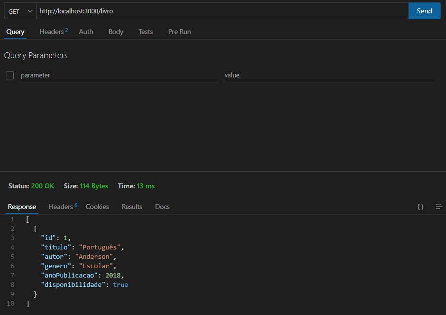

# LibraryApi
Projeto da disciplina  Back-end Frameworks para construção de uma API de um sistema de biblioteca.

# Sistema de Gerenciamento de Biblioteca

Bem-vindo ao Sistema de Gerenciamento de Biblioteca! Este projeto oferece APIs para gerenciar livros, usuários e empréstimos com funcionalidades completas de CRUD.

## Descrição do Projeto

Este sistema foi desenvolvido para auxiliar no gerenciamento de bibliotecas. Ele permite que você:
- Gerencie o catálogo de livros
- Controle os registros de usuários  
- Acompanhe os empréstimos de livros e devoluções

A API segue os padrões RESTful e pode ser facilmente integrada a sistemas frontend ou ferramentas de gerenciamento.

## Como Baixar o Repositório 

Siga os passos abaixo para obter o código do projeto:

1. Clone o repositório:
```bash
git clone <link_do_repositorio>
```

2. Navegue até o diretório do projeto:
```bash
cd nome_do_diretorio
```

3. Instale as dependências:
```bash
npm install
```

## Pré-requisitos
Antes de começar, você precisará das seguintes ferramentas instaladas em seu ambiente:

- Node.js (versão 14 ou superior)
- NPM ou Yarn
- Banco de Dados (MySQL, PostgreSQL ou MongoDB)

Certifique-se de configurar as variáveis de ambiente no arquivo .env:
```bach
DB_NAME= <nome_do_banco>
DB_USER= <user_do_seu_banco>
DB_HOST= <host_do_bando_ex:localhost>
DB_PASSWORD= <senha_do_banco>
DB_PORT= 3000

```

## Endpoints Disponíveis
Livros

- POST /livros - Adiciona um novo livro
- GET /livros - Lista todos os livros
- PUT /livros/{id} - Atualiza as informações de um livro específico
- DELETE /livros/{id} - Remove um livro

Usuários

- POST /usuarios - Adiciona um novo usuário
- GET /usuarios - Lista todos os usuários
- PUT /usuarios/{id} - Atualiza as informações de um usuário específico
- DELETE /usuarios/{id} - Remove um usuário

Empréstimos

- POST /emprestimos - Registra um novo empréstimo
- GET /emprestimos - Lista todos os empréstimos
- PUT /emprestimos/{id} - Atualiza as informações de um empréstimo específico
- DELETE /emprestimos/{id} - Remove um empréstimo

## Contribuindo
Contribuições são sempre bem-vindas! Siga os passos abaixo para contribuir com o projeto:

1. Faça um fork do repositório
2. Crie uma branch para sua funcionalidade:

```bash 
checkout -b minha-nova-funcionalidade
```

3. Faça suas alterações e commit:

```bash
commit -m "Descrição do que foi alterado"
```

4. Envie para o repositório remoto:

```bash
push origin minha-nova-funcionalidade
```

5. Abra um Pull Request no repositório original

## Autores

1. Gabriel Porfírio - @gabriel_porfirioo
2. Osvaldo Vasconcelos - @ValdVdC
3. Flávio Vecch - @Fvecch
4. Ewerton Thyago - @ewertonthyago

## Licença
Este projeto está licenciado sob a MIT License. Sinta-se à vontade para usar, modificar e compartilhar conforme necessário.

## Imagens do Projeto
Exemplo de Requisição:
<br/>
1. Livros

<br/>

<br/>
2. Usuários

<br/>
3. Relatório

<br/>

<br/>


